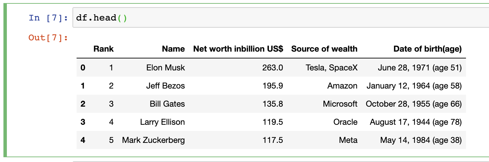
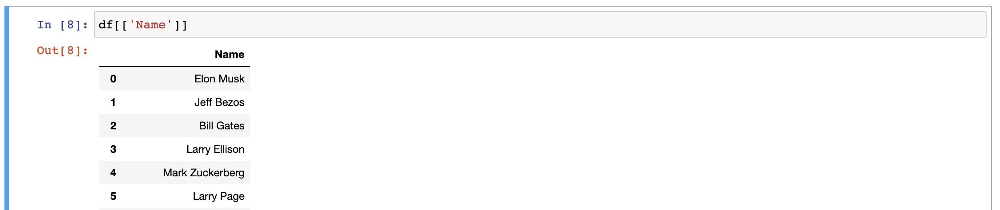
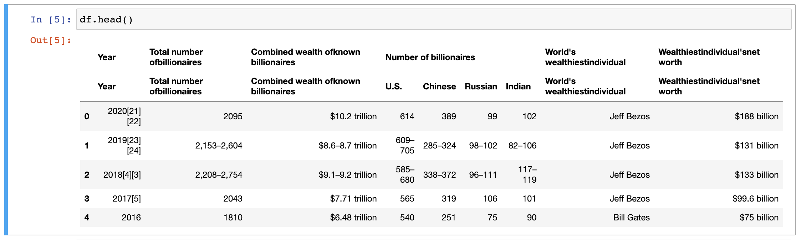

# How to Read HTML Tables With Pandas

[](https://oxylabs.io/pages/gitoxy?utm_source=877&utm_medium=affiliate&groupid=877&utm_content=pandas-read-html-2-github&transaction_id=102f49063ab94276ae8f116d224b67)

[](https://discord.gg/Pds3gBmKMH) [](https://www.youtube.com/@oxylabs)


<a href="https://github.com/topics/pandas"></a> <a href="https://github.com/topics/web-scraping"></a>

- [How to Read HTML Tables With Pandas](#how-to-read-html-tables-with-pandas)
- [​Install Pandas](#install-pandas)
- [Web scraping with Pandas](#web-scraping-with-pandas)
  - [Importing Pandas​](#importing-pandas)
  - [Reading Tables from Webpage](#reading-tables-from-webpage)
  - [Preview Results](#preview-results)
  - [Parsing Dates](#parsing-dates)
  - [Locating Specific Table​s](#locating-specific-tables)
  - [Scraping a Specific Column](#scraping-a-specific-column)
  - [Skipping a Row](#skipping-a-row)
- [Saving Data to CSV](#saving-data-to-csv)


Pandas library is made for handling data with columns and rows. Often, you would need to scrape HTML tables from web pages.

This guide demonstrates how to read HTML tables with pandas with a few simple steps.

# ​Install Pandas

To install pandas, we recommend that you use Anaconda. Alternatively, you can install pandas without Anaconda using PIP. You can also install Jupyter Notebook with PIP as follows:

```shell
pip install pandas
pip install notebook
```

# Web scraping with Pandas

## Importing Pandas​

```python
import pandas as pd
```

​

## Reading Tables from Webpage

Use the `read_html` function to parse tables from a webpage. This function returns a `list` of `DataFrames`

```python
url = 'https://en.wikipedia.org/wiki/List_of_wealthiest_Americans_by_net_worth'
dfs = pd.read_html(url)
df = dfs[0]
```

You can use a different parser, such as BeautifulSopup by setting `flavor='bs4'` 

```python
dfs = pd.read_html(url, flavor='bs4')
```

## Preview Results

```python
df.head()
```



## Parsing Dates

In this example, the date contains other info that needs to be cleaned up:

```python
df['Date of birth(age)'] = df['Date of birth(age)'].str.replace(r'\(.*\)', '', regex=True)
```

Next, convert this `obj`  datatype to a `datetime64` datatype as follows:

```python
df['Date of birth(age)'] = pd.to_datetime(df['Date of birth(age)'])
```

## Locating Specific Table​s

You can use the `match` parameter to find only the tables that contain the desired text. 

```python
url = 'https://en.wikipedia.org/wiki/The_World%27s_Billionaires'
dfs = pd.read_html(url, flavor='bs4', match='Source\(s\) of wealth')
```


## Scraping a Specific Column

`read_html` will return the entire table in a data frame. To get a specific column, use pandas filtering as follows:

```python
df[['Name']]
```




## Skipping a Row

See the following example:

```python
url = 'https://en.wikipedia.org/wiki/Billionaire'
dfs = pd.read_html(url, flavor='bs4',match='known billionaires')
```



Usually, if you want to skip rows, you can use the `skiprows` parameter:

```python
dfs = pd.read_html(url, skiprows=1)
```

In this case, we will have to remove one header row as follows:

```python
df.droplevel(0,axis=1)
```

# Saving Data to CSV

Use the `to_csv` method of the data frame object:

```python
df.to_csv('file_name.csv',index=False)
```


